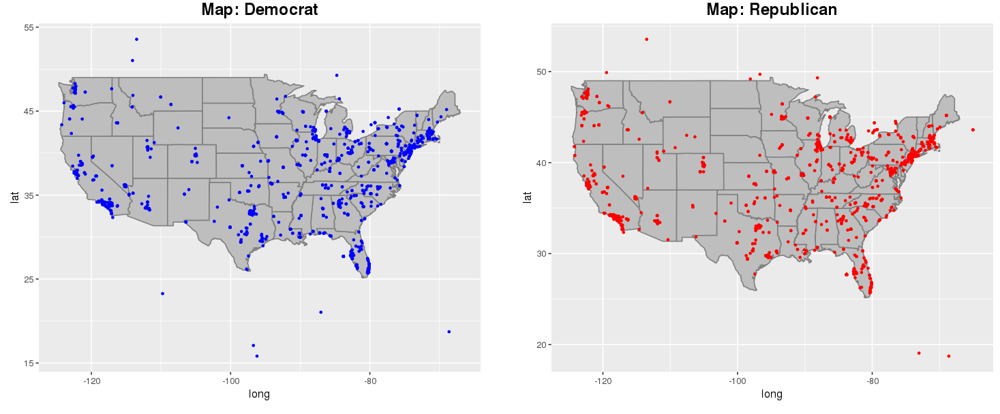

```{r setup, include=FALSE}
knitr::opts_chunk$set(echo = TRUE)
```

# Abstract

By drawing real-time data from Twitter’s API, we have built an interactive Shiny app that allows users to conduct comparative keyword analysis. Simply by typing in two keywords of interest, users can obtain information on the search’s geographical distribution and tweet content, returned side-by-side on screen. By extracting data from the app, the user can also customize advanced analyses such as statistical tests, and gain a deeper understanding of different trends through social media.

# Introduction

We are interested in building a real-time Twitter keyword analysis tool that will allow users to study the most up-to-date trends and conduct comparative analysis, thereby obtaining a clearer understanding of different political, cultural, and social issues.

Our interest in Twitter is two-fold. On the one hand, it is a great platform to gauge into public opinions. It is one of the largest and most diverse social media platforms, with 70 million active users ranging from politicians to entrepreneurs. On the other hand, there is a void in extracting these public opinions effectively. Most users are sealed off in their bubbles and losing sight of the larger pictures.

Our tool is real-time, user-friendly, and multi-faceted. To gain insights into the popularity of the two keywords, we show maps of their geographic distribution. Then, we color each state by the color of the more searched keyword. However, just because a keyword is tweeted more times, does not mean the public have a more favorable opinion on that word. We then provide the top hashtags, top favorited/retweeted tweets, and tweets by most followed users related to the keywords. We believe that this could help users gain an understanding of the tweeted content.


# Data
Using Twitter Developer API, we retrieved the most recent 18,000 tweets in the US containing a keyword specified by the user. The following line is the code used to do so:

```{r eval = FALSE}
rt <- search_tweets(
  "KEYWORD", n = 18000, include_rts = FALSE, geocode = lookup_coords('usa')
)
```

The returned data set contained 88 variables - of which, we used screen_name, text, source, favorite_count, retweet_count, hashtags, media_type, bbox_coords, and followers_count. 

To derive latitude and longitude from bbox_coords, we used vector operations and a for loop. bbox_coords stands for bounding box coordinates, in which bounding box refers to a box-shaped region that contains the specific location. To approximate the user’s location from this information, we averaged the latitudes and longitudes of bbox_coords and used the center of the box as our approximation. In addition, we combined methods in maptools and maps packages to write a method that returns the name of the state, given a coordinate. Then, we used the method to identify state of each tweet. 

For each tab, we used a series of dplyr chains to organize data in a format specific to the purpose. For example, in creating a tab that returns the top hashtags, we used the following code. 
```{r eval = FALSE}
rt2 <- rt_var %>%
  select(hashtags) %>%
  filter(!is.na(hashtags))

hashtag_name <- vector()

for(hashtag in rt2$hashtags){
  for(tag in hashtag){
    hashtag_name = c(hashtag_name, tag)
  }
}

freq <- data.frame(hashtag_name) %>%
  group_by(hashtag_name) %>%
  summarise(count = n()) %>%
  arrange(desc(count))
```

Because the hashtags column contained values in a string vector format, we first took each hashtag within each vector and appended them to a new vector called hashtag_name. After, we casted the vector into a data frame, grouped by hashtag, and summarised with count of each hashtag to return a data frame containing frequency of each hashtag. Similarly, we used dplyr chains, for loops, apply functions, and vector operations to format the original dataset into different forms.

# Results
Some examples of our comparative keyword trend visualization is as follows:




In an example of using our app for a potent trend analysis, we gathered 2017 party affiliation statistics by state and compared with the equivalent data gathered through our app. The 2017 data contained the percentage of democrats and the percentage of republicans for each state. For the purpose of this study, we classified a tweet as supporting one party if the tweet contained the party’s name and computed percentages of democrats/republicans for each state.

To examine whether there was a statistically significant difference in the two distributions, we used a chi-squared test.

Our null hypothesis stated that the distribution of 2017 political party affiliation by state is identical to the distribution of real-time political party affiliation by state.

Our alternative hypothesis was that distribution of 2017 political party affiliation by state is different from the distribution of real-time political party affiliation by state.

```{r message = FALSE, echo = FALSE, include = FALSE}
library(dplyr)
pd_2017 <- read.csv('party_distribution.csv')
pd <- pd_2017[1:3] %>%
  mutate(state = tolower(State)) %>%
  select(state, Democrat.Percentage, Republican.Percentage)
names(pd) <- c('state', 'democratic_percentage_2017', 'republican_percentage_2017')
data <- readRDS('our_data.rds')
data <- data %>%
  mutate(sum = count1 + count2) %>%
  mutate(dem_percentage = round(count1 / sum * 100, 0), rep_percentage = round(count2 / sum * 100, 0)) %>%
  select(state, dem_percentage, rep_percentage)
names(data) <- c('state', 'democratic_percentage_app', 'republican_percentage_app')

both <- merge(data, pd, by='state')
```

```{r warning = FALSE, message = FALSE}
chisq.test(x = both$democratic_percentage_app,y = both$democratic_percentage_2017)
```

Using the above line, we obtained a p-value of 0.1122. Since p-value of 0.1122 is greater than the alpha value of 0.05, we fail to reject the null hypothesis and concluded that we do not have sufficient evidence to suggest that the real time trend observed using our app differs from the 2017 political party affiliation by state.

# Conclusion

We created this shiny app in hopes of achieving two goals: to gain a deeper understanding of most up-to-date public opinions/trends on keywords and to comparatively visualize these trends. We successfully created an app that does so in multiple ways - comparing geographical distributions, top hashtags, top retweeted tweets, top favorited tweets, and tweets by most followed users. In a more hands-on example, we compared the 2017 political party affiliation by state with the most up-to-date equivalent data using our app and found that there hasn’t been a statistically significant difference.

One limitation of our app is that it does not conduct a deep enough analysis of each individual tweet. For instance, in the party affiliation example, we categorized a tweet as supportive of the Republican party if it contained the keyword ‘Republican.’ However, using the keyword ‘Republican’ in the tweet does not always imply the user identifies as a Republican and we should not hastily assume so. Therefore, although our app is great for visualizing real-time Twitter trends, we must be careful and we must conduct a deeper, more accurate tweet analysis to draw conclusions from these trends.


